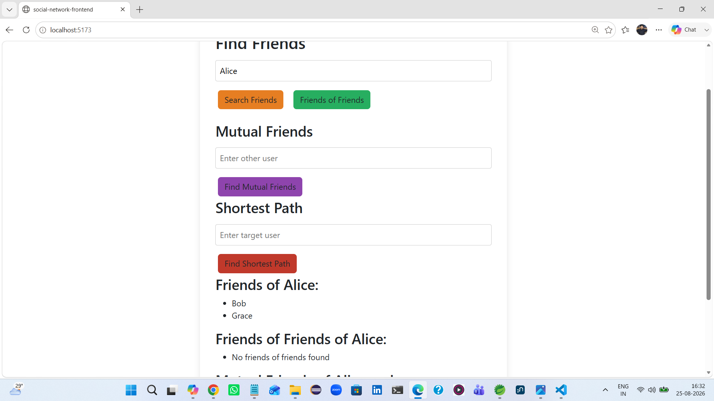
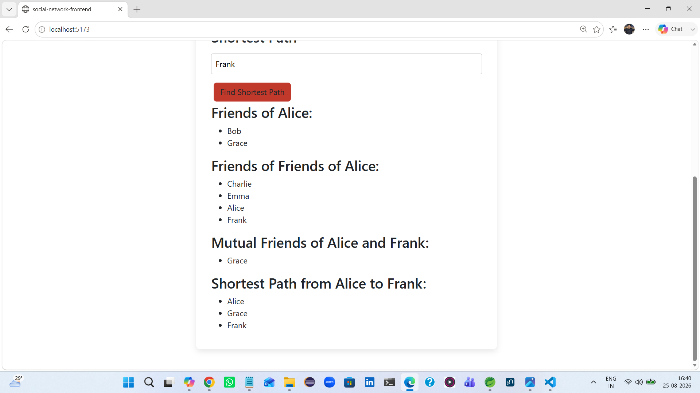

# Social Network Demo (CognoDB + Spring Boot + React)

## 1. Overview
This project is a simple **social network demo** built with:
- **Backend**: Spring Boot + Spring Data Neo4j
- **Frontend**: React + Vite
- **Database**: CognoDB (Neo4j-compatible)

It demonstrates how graph databases can model and query relationships such as:
- Direct friends
- Friends of friends (multi-hop traversal)
- Mutual friends
- Shortest path between users

---

## 2. Why a Graph Database?
Traditional relational databases store data in tables, which makes queries about relationships awkward and inefficient.  
Graph databases like CognoDB are designed for **connections**:

- **Multi-hop traversal**: Easily find “friends of friends” with a single Cypher query.  
- **Mutual friends**: Natural pattern matching instead of complex SQL joins.  
- **Shortest path**: Built-in graph algorithms, impossible to express cleanly in SQL.  

 In this use case, a graph database earns its place because the core problem is about **relationships**, not rows.

---

## 3. Data Model
- **Node Label**: `User`
  - Properties: `name`, `age`, `city`
- **Relationship**: `FRIEND` (bidirectional)

### Diagram

Alice ↔ Bob ↔ Charlie ↔ David ↔ Emma ↔ Frank ↔ Grace ↔ Alice
Extra links: Bob ↔ Emma, Charlie ↔ Grace


---

## 4. Seed Data
Located in `social-network-backend/data.cypher`.

Example:
```cypher
// Users with properties
CREATE (a:User {name:'Alice', age:25, city:'Hyderabad'})
CREATE (b:User {name:'Bob', age:27, city:'Hyderabad'})
CREATE (c:User {name:'Charlie', age:30, city:'Delhi'})
CREATE (d:User {name:'David', age:28, city:'Mumbai'})
CREATE (e:User {name:'Emma', age:26, city:'Chennai'})
CREATE (f:User {name:'Frank', age:32, city:'Bangalore'})
CREATE (g:User {name:'Grace', age:29, city:'Hyderabad'})

// Friendships (bidirectional)
CREATE (a)-[:FRIEND]->(b)
CREATE (b)-[:FRIEND]->(a)

CREATE (b)-[:FRIEND]->(c)
CREATE (c)-[:FRIEND]->(b)

CREATE (c)-[:FRIEND]->(d)
CREATE (d)-[:FRIEND]->(c)

CREATE (d)-[:FRIEND]->(e)
CREATE (e)-[:FRIEND]->(d)

CREATE (e)-[:FRIEND]->(f)
CREATE (f)-[:FRIEND]->(e)

CREATE (f)-[:FRIEND]->(g)
CREATE (g)-[:FRIEND]->(f)

CREATE (g)-[:FRIEND]->(a)
CREATE (a)-[:FRIEND]->(g)

// Extra cross-links
CREATE (b)-[:FRIEND]->(e)
CREATE (e)-[:FRIEND]->(b)

CREATE (c)-[:FRIEND]->(g)
CREATE (g)-[:FRIEND]->(c)


---

## 5. Queries
Implemented in UserRepository.java:

Direct friends
MATCH (u:User {name:$name})-[:FRIEND]->(f:User) RETURN f


Friends of friends
MATCH (u:User {name:$name})-[:FRIEND]->()-[:FRIEND]->(fof:User) RETURN DISTINCT fof


Mutual friends
MATCH (u:User {name:$name})-[:FRIEND]->(f:User)<-[:FRIEND]-(v:User {name:$other}) RETURN f

Shortest path
MATCH p=shortestPath((u:User {name:$name})-[:FRIEND*..5]-(v:User {name:$target})) RETURN p

---

## 6. Application Features
Search direct friends

Search friends of friends

Find mutual friends between two users

Find shortest path between two users

Clean UI with loading/error states

---


## 7. Setup Instructions

Backend

1.Clone repo:
git clone https://github.com/kiranchitram/social-network-demo.git

2.Set environment variables (instead of committing secrets):
export NEO4J_URI=bolt+s://<instance-id>.databases.cognodb.cloud
export NEO4J_USERNAME=cognodb
export NEO4J_PASSWORD=<your-password>

3.Run backend:mvn spring-boot:run

Backend runs locally on http://localhost:8080.
Backend runs on Live in https://social-network-graph-demo.onrender.com/users/Alice/friends

==============================================


Frontend

1.Navigate to frontend:
cd social-network-frontend

2.Install dependencies:
npm install

3.Run dev server:
npm run dev

Frontend locally runs on http://localhost:5173.
Frontend Live on https://social-network-frontend-17qq.onrender.com

---


## 8. Screenshots

### Direct Friends


### Friends of Friends


### Mutual Friends


### Shortest Path


### Graph Visualization


